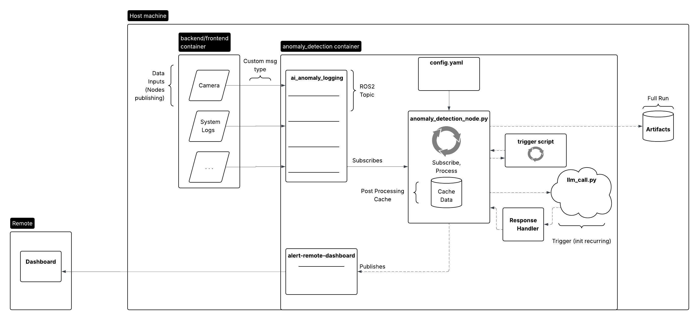
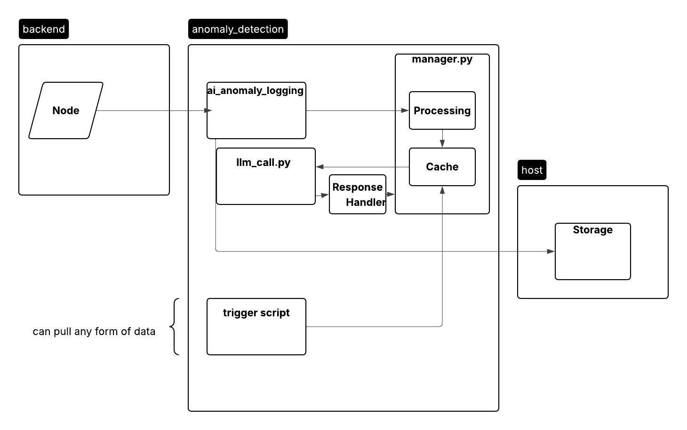

# AI Anomaly Detection
Last updated: 4/9/2026 (Sprint 3)

Anomaly Detection ROS2 system. Integrates with LiteLLM (https://docs.litellm.ai/docs/) for API integration. Trigger scripts now run as ROS nodes that communicate over an intermediary `/trigger_messages` topic (refactored from direct script import in Sprint 2).

1. Subscribes to `raw_input_topic` containing AnomalyMsg types
2. Processes them into LLM-friendly format & stores in cache
3. Periodic/on-demand trigger via ROS node publishing to `/trigger_messages`
4. LLM call using `llm_client.py`; a JSON artifact capturing the cached input data and model response is saved to `/tmp/aad_api_bags/` on each invocation
5. LLM response standardization into `Decision` type using `response_handler.py`
6. Decision evaluation and alert publishing
7. `.bag` file of entire run context monitoring `raw_input_topic`

Sprint 4 will focus on finalized system documentation, scenario recordings/dataset creation, (potentially) security vulnerability addressing, and planning system evaluation methods.

## Prerequisites

_It is recommended that this system exists in a Docker container that shares a network with (or contains) the source of ROS2 topics publishing system data. See (https://github.com/JACart2/docker_files)_

* ROS2 installed
* Requirements.txt. See (https://github.com/JACart2/docker_files/blob/main/services/anomaly_detection/requirements.txt)
* `.env` for local testing/prod run. Contains the API key associated with the model specified in `config.yaml`

## Project Structure

### ./anomaly_msg
The declaration of the custom message type that the anomaly detection system expects. Any data source that provides context to the anomaly detection service should send information using this message type to the topic specified in `config.yaml` under `raw_input_topic`.

### ./tester
Provides two utility nodes: `fake_camera_data` and `lidar_test_node`. Both publish fake data and may be used to test dataflow in the system without external node access. Run with `ros2 run tester <NODE>`.

### ./anomaly_detection
The ROS2 node declaration for the anomaly detection system. `anomaly_detection_node.py` contains the manager handling API integration, data collection/processing, trigger integration, and alert publishing.

`config.yaml` contains system configuration, including the `trigger_scripts` key that lists which trigger scripts to spin up as ROS nodes.

`llm_client.py` is the API integration layer, tested with OpenAI via LiteLLM.

`response_handler.py` standardizes API responses into a `Decision` type.

### ./trigger_scripts
Each trigger script runs as its own ROS node and publishes to the `/trigger_messages` intermediary topic. Adding a new trigger script requires:

**Required:**
- `trigger_scripts/<SCRIPT_NAME>/<SCRIPT_NAME>.py` — the ROS node
- `trigger_scripts/<SCRIPT_NAME>/install.sh`
- `config.yaml['trigger_scripts']` entry: `['<SCRIPT1_NAME>', '<SCRIPT2_NAME>']`

**Optional:**
- `trigger_scripts/<SCRIPT_NAME>/requirements.txt`

## Offline Testing

A script is provided for running multiple configs against the dataset in batch:

```
python3 path/to/run_aad_config_tests.py --csv dataset.csv --configs openai_config.yaml ollama_config.yaml other_configs.yaml
```

**Notes:**
- Create `bags/` and `configs/` folders inside `dev_ws/` before running
- Run the script from the `dev_ws/` directory; otherwise it will be unable to start `anomaly_detection_node`

### Dataset Outline

The dataset is a `.csv` file (`dataset_outline.csv`) with one row per scenario. Fields:

| Field | Values |
|---|---|
| Anomaly Category | Normal, Dynamic obstacle, Static obstacle, Mechanical issue, Sensor issue, Unauthorized access, Route issue |
| Description | Additional detail about the anomaly |
| Anomalous | Yes / No |
| Bag file | Name of the associated `.mcap` bag file |

Store all bag files in the `bags/` folder inside `dev_ws/`.

## Artifact Generation

Each time the LLM is invoked, a JSON artifact is written to `/tmp/aad_api_bags/` capturing a snapshot of the system state. This improves transparency when testing or tuning the system.

Each artifact includes:
- **Artifact ID** — unique traceable identifier
- **Cached Data** — the log messages collected before the LLM call
- **API Response** — the structured decision returned by the LLM (anomaly flag, severity, action, summary)

## Security Considerations

### Sensor and Telemetry Spoofing
Attackers could send fake sensor or telemetry data to manipulate LLM decisions. Mitigations under consideration include integrity checks and cross-validation across multiple sensors.

### Tampered Logs
Logs used by the anomaly detection system could be modified or deleted, hiding malicious activity. Mitigations under consideration include tamper-event logging and time-stamped records of changes.

## System Diagrams

### Architecture Diagram


### Dataflow Diagram


## Usage

Start the anomaly detection node:

```
ros2 run anomaly_detection anomaly_detection_node
```

This requires a `.env` file in the same folder as the AAD node, with API keys in the format:

```
<Provider-Name>_API_KEY=<Your-Key>
```

See `config.yaml` for full deployment configuration options, including model selection, topic names, and trigger script registration.
