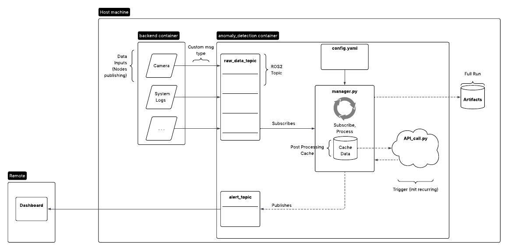
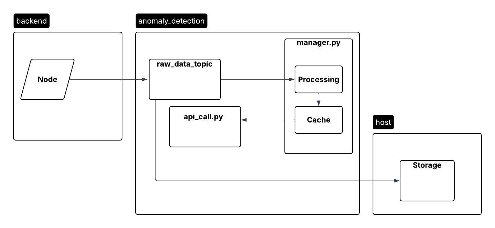

# AI Anomaly Detection
Last updated: 3/20/2026 (Sprint 2)

Anomaly Detection ROS2 system. Set to integrate with LiteLLM (https://docs.litellm.ai/docs/) for API integration. Currently integrates with trigger scripts through trigger_script folder directly (will be rewritten to use new topic in Sprint 3)

Future development should provide alternatives for API integration, API buffer models, data source topics, meaningful data processing, and automated system deployment and artifact creation. 

## Prerequisites
_It is recommended that this system exists in a Docker container that shares a network with the source of ROS2 topics publishing system data. See (https://github.com/JACart2/docker_files)_

* ROS2 installed
* Requirements.txt (see https://github.com/JACart2/docker_files/blob/main/services/anomaly_detection/requirements.txt)
* .env for local testing/prod run. Contains the API key associated with the model specified in config.yaml

## Project Structure

### ./anomaly_msg
The declaration of the custom message type that the anomaly detection system expects. Any data source that provides context to the anomaly detection service should send information using this message type to the topic specified in the config.yaml `raw_input_topic`.

### ./tester
This provides two utility nodes: `fake_camera_data` and `lidar_test_node`. Both of these will publish fake data and may be used to test dataflow in the system without external node access. This can be ran with `ros2 run tester <NODE>`.

### ./anomaly_detection
This is the ROS2 node declaration for the anomaly detection system. The logic is located under `./anomaly_detection/anomaly_detection`. `anomaly_detection_node.py` contains the manager that will handle API integration, data subscription, data processing, and subsequent action for the system to take if anomalies are detected. `config.yaml` contains system configuration for the system. `llm_client.py` is the current API integration.

## System Diagrams

### Architecture Diagram

### Dataflow Digram

## Usage

Running this command: 
`ros2 run anomaly_detection anomaly_detection_node`
will start the anomaly detection node.

However, note the dependencies in prerequisites, and the specifications of `./anomaly_detection/anomaly_detection/config.yaml` for successful deloyment.
